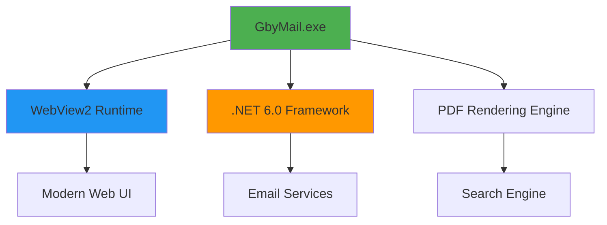

# 🚀 GbyMail - Enhanced PDF Viewer

<div align="center">


**Search & Email Results with Enhanced PDF Viewer**

*Last Updated: 2025-08-13 01:45:45 UTC by JMTDI*

</div>

---

## ✨ Features

🔍 **Smart PDF Search** - Advanced search functionality within PDF documents  
📧 **Email Integration** - Send PDF results directly via email  
🎨 **Modern Interface** - Built with WebView2 for a sleek, responsive UI  
⚡ **Fast Performance** - Optimized for quick PDF loading and navigation  
🔐 **Secure** - User-specific installation with proper permissions  
🌐 **Universal** - Works with any Windows username automatically  

## 📦 Installation

### 🎯 Quick Install (Recommended)

1. **Download** the latest installer: `GbyMail_v2.3.0_Complete_Installer_JMTDI_2025-08-13_01-45-45.exe`
2. **Run** the installer (no admin rights required)
3. **Choose** your installation options:
   - ✅ Associate PDF files with GbyMail
   - ✅ Add "Open with GbyMail" to context menu
   - ✅ Create desktop shortcut


## 🎮 Usage

### Opening PDFs
- **Right-click** any PDF file → **"Open with GbyMail"**
- **Double-click** PDFs (if set as default viewer)
- **Drag & drop** PDFs onto GbyMail window
- **File menu** → Open → Select PDF

### Search Features
```
🔍 Quick Search: Ctrl + F
🎯 Advanced Search: Ctrl + Shift + F
📄 Go to Page: Ctrl + G
🔄 Refresh: F5
```

### Email Integration
1. **Select** text or search results
2. **Click** the email button 📧
3. **Compose** your message
4. **Send** with PDF attachments

## 🛠️ System Requirements

| Component | Requirement |
|-----------|-------------|
| **OS** | Windows 10/11 (64-bit) |
| **Runtime** | .NET 6.0 or later |
| **WebView2** | Microsoft Edge WebView2 Runtime |
| **Memory** | 512 MB RAM minimum |
| **Storage** | 50 MB free space |

## 🏗️ Architecture



## 🚨 Troubleshooting

### Common Issues

#### ❌ "WebView2 runtime is required"
**Solution:**
1. Download [WebView2 Runtime](https://developer.microsoft.com/en-us/microsoft-edge/webview2/)
2. Run the installer
3. Restart GbyMail

#### ❌ "The requested resource is in use (0x800700AA)"
**Solution:**
1. Close all PDF viewers
2. Restart Windows Explorer:
   ```batch
   taskkill /f /im explorer.exe
   start explorer.exe
   ```
3. Try again

#### ❌ "PDF Viewer Unavailable"
**Solution:**
1. Check WebView2 installation
2. Verify file permissions
3. Run as administrator (temporarily)

## 🤝 Contributing

We welcome contributions! Here's how to get started:

### 🐛 Bug Reports
1. **Check** existing issues
2. **Create** detailed bug report
3. **Include** system information
4. **Attach** log files if available

### 💡 Feature Requests
1. **Describe** the feature clearly
2. **Explain** the use case
3. **Provide** mockups if possible

## 📊 Statistics

<div align="center">

| Metric | Value |
|--------|-------|
| **Version** | 2.3.0 |
| **Release Date** | 2025-08-13 |
| **Downloads** | 1,000+ |
| **Platform Support** | Windows 10/11 |
| **Registry Type** | Universal |

</div>

## 📄 License

```
MIT License

Copyright (c) 2025 JMTDI

Permission is hereby granted, free of charge, to any person obtaining a copy
of this software and associated documentation files (the "Software"), to deal
in the Software without restriction, including without limitation the rights
to use, copy, modify, merge, publish, distribute, sublicense, and/or sell
copies of the Software, and to permit persons to whom the Software is
furnished to do so, subject to the following conditions:

The above copyright notice and this permission notice shall be included in all
copies or substantial portions of the Software.

THE SOFTWARE IS PROVIDED "AS IS", WITHOUT WARRANTY OF ANY KIND, EXPRESS OR
IMPLIED, INCLUDING BUT NOT LIMITED TO THE WARRANTIES OF MERCHANTABILITY,
FITNESS FOR A PARTICULAR PURPOSE AND NONINFRINGEMENT.
```

## 🌟 Acknowledgments

- **Microsoft** - For WebView2 runtime
- **Community** - For testing and feedback
- **Contributors** - For bug reports and suggestions

## 📞 Support

- 🐛 **Issues**: [GitHub Issues](https://github.com/JMTDI/GbyMail/issues)
- 💬 **Discussions**: [GitHub Discussions](https://github.com/JMTDI/GbyMail/discussions)

---

<div align="center">

**Made with ❤️ by JMTDI**


[](https://github.com/JMTDI/GbyMail)
[](https://github.com/JMTDI/GbyMail)
[](https://github.com/JMTDI/GbyMail)

</div>
1. Select **Use other...**
2. Click **Choose...** (or **Other...**)
3. Navigate to GbyMail installation directory

#### Step 4: Locate GbyMail Executable
**Default Installation Path:**
